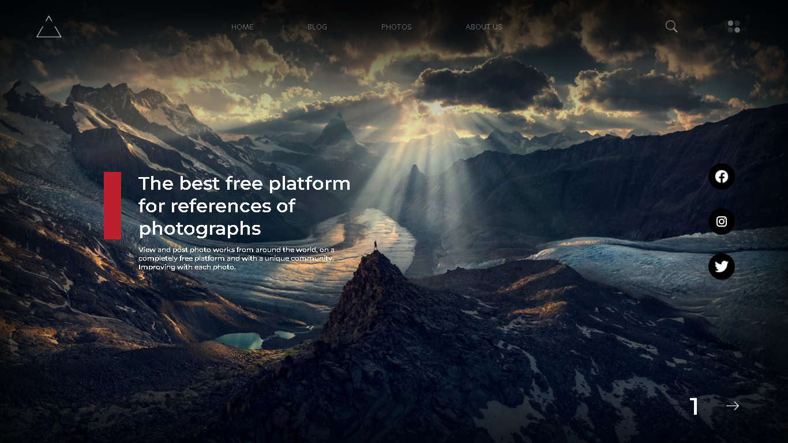
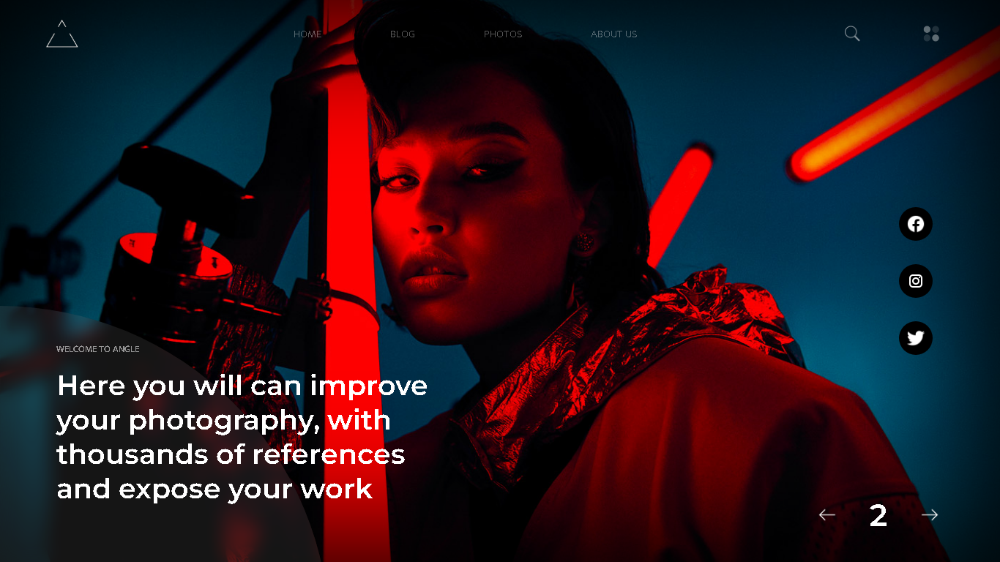
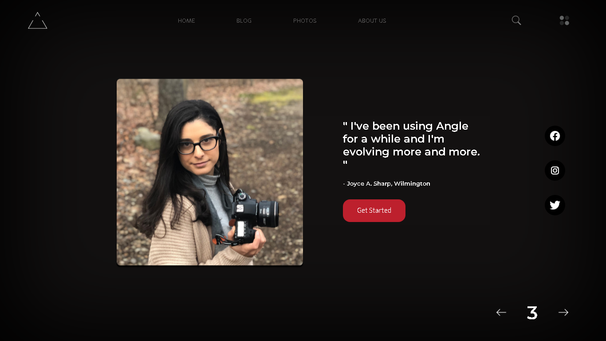

## 👀 Overview

Um silder criado em HTML, CSS e JAVASCRIPT para uma plataforma de trabalho para fotografos, onde você pode postar seus trabalhos e criar Network totalmente de graça

 
<h2 align="center">Slide 1</h3>
 
<h2 align="center">Slide 2</h3>
 
<h2 align="center">Slide 3</h3>
 

## 💡 Ideia 

Esse projeto foi criado para treinar efeito de slide que aprendi nas aulas do meu curso, para isso, criei uma página de boas-vindas para uma plataforma que funciona como uma rede social.
O Angle é uma plataforma onde fotografos podem criar Network e postar seus trabalhos para o mundo todo, eu pretendo continuar esse projeto depois com um pouco mais de lógica, mas de inicio, o principal era criar um alide bem estrutura com JAVASCRIPT e utilizando de algumas animações.

## ⚙️ Tools

 - HTML
 - CSS
 - JAVASCRIPT

 
 

## 🚀 Future
  

### Código
Como dito antes, este projeto provavelmente será levado para frente com um pouco mais de lógica, ou talvez seja recriado em React ou outro framework.

 
 

 
 
 
<h3 align="center"> Criado com muito ❤️ por <a href="https://github.com/VBrianB"> Vinicius Brian Bolzani</a></h2>
